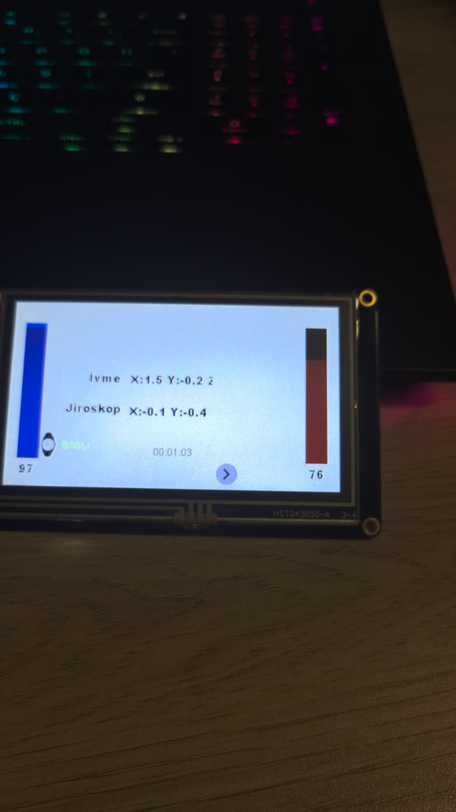
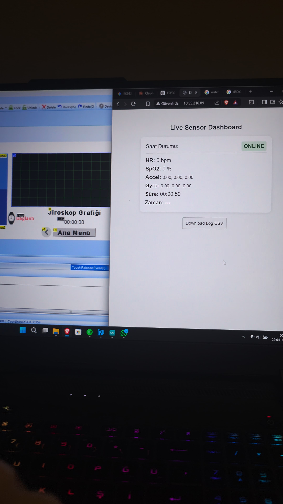
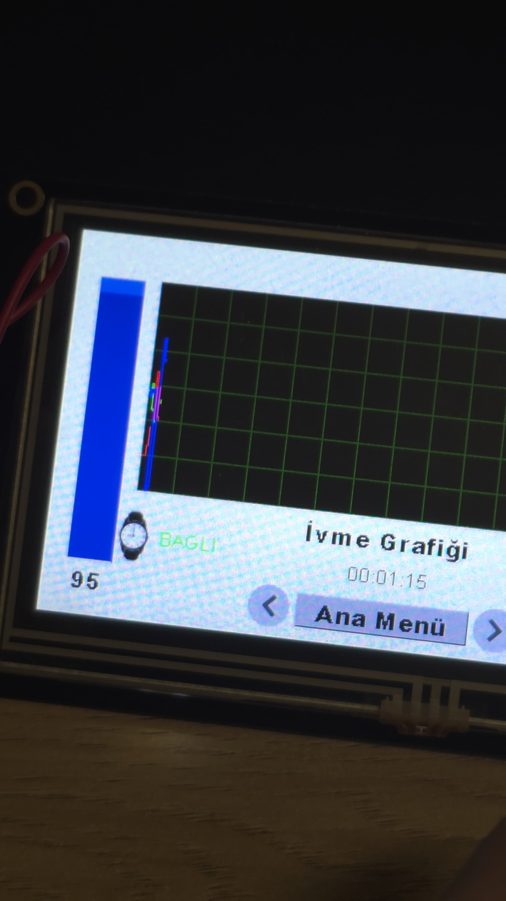
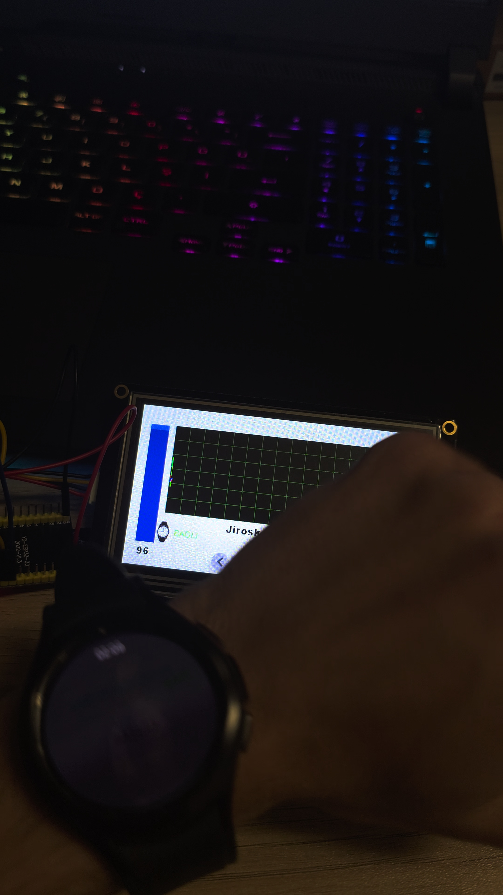

# 📡 Smart Telemetry System

A hybrid real-time telemetry system that streams biometric and motion sensor data from a Samsung Galaxy Watch (Wear OS) to an ESP32 host, which aggregates and displays the data on a Nextion HMI touchscreen and a web dashboard.

## 📸 Screenshots

<table>
  <tr>
    <td></td>
    <td></td>
  </tr>
  <tr>
    <td></td>
    <td></td>
  </tr>
</table>

## 🔄 Data Flow

```
Galaxy Watch (Wear OS)
        │
        │  HTTP POST /sensor  (JSON: hr, spo2, accel, gyro)
        ▼
ESP32 Telemetry Host  ──────────►  Nextion HMI Display (Serial)
        │
        │  HTTP GET /data     (JSON)
        ▼
Web Dashboard (served by ESP32)
```

## 🧩 Project Structure

```
Smart-Telemetry-System/
├── Android_WearOS/      ← Wear OS sender app (Kotlin, Jetpack Compose)
├── ESP32_Firmware/      ← ESP32 HTTP server + Nextion display controller
└── HMI_UI/             ← Nextion HMI project file
```

## ✨ Features

- **Heart Rate & SpO2** — Streams HR/SpO2 readings from watch sensors
- **IMU Data** — Accelerometer and gyroscope (X/Y/Z axes)
- **Live Web Dashboard** — ESP32 serves a real-time HTML dashboard with CSV export
- **HMI Display** — Bar charts and waveform graphs on a Nextion touchscreen
- **Online/Offline Detection** — 10-second timeout watchdog for watch connectivity

## 🛠 Tech Stack

| Component | Technology |
|---|---|
| Sender | Kotlin · Jetpack Compose · OkHttp3 |
| Host | ESP32 · Arduino (C++) · ArduinoJson |
| Display | Nextion HMI (ILI9341 compatible) |
| Protocol | HTTP/JSON over local Wi-Fi |

## 🚀 Getting Started

### ESP32 Firmware

1. Open `ESP32_Firmware/ESP32-Telemetry-Host.ino` in Arduino IDE.
2. Fill in your Wi-Fi credentials:
   ```cpp
   const char* ssid = "YOUR_WIFI_SSID";
   const char* pass = "YOUR_WIFI_PASSWORD";
   ```
   > ⚠️ Never commit real credentials. Use a config file or `#define` override.
3. Select `Board: ESP32 Dev Module`, choose the correct port, and upload.
4. Note the IP address printed on Serial Monitor.

### Wear OS App

1. Open `Android_WearOS/` in Android Studio.
2. Set the ESP32 IP in `Network.kt`:
   ```kotlin
   var espIp: String = "YOUR_ESP32_IP"
   ```
3. Deploy to a Galaxy Watch or Wear OS emulator.

### Web Dashboard

Once the ESP32 is running and connected to Wi-Fi, open `http://<ESP32_IP>/` in a browser to view live sensor data and download CSV logs.

## 📋 API Endpoints (ESP32)

| Method | Endpoint | Description |
|---|---|---|
| GET | `/` | Live sensor web dashboard |
| GET | `/data` | Current sensor data (JSON) |
| GET | `/ping` | Connectivity check |
| POST | `/sensor` | Receive data from Watch |

## 👨‍💻 Developer

Created and developed by **[Serhan Ensar](https://github.com/SerhanEnsar)**.

## 📄 License

MIT
